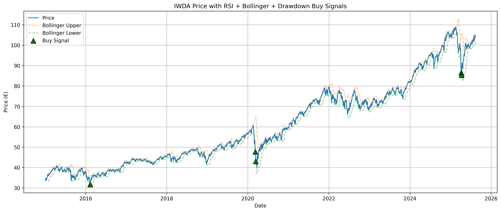

# IWDA Buy-Signal Visualizer

Visualize potential **buy signals** on the iShares Core MSCI World UCITS ETF (IWDA.AS) using a confluence of:
- **RSI (14)** oversold condition
- **Bollinger Bands (20, ±2σ)** lower band breach
- **Drawdown** exceeding **-20%** from the running ATH

When all three conditions align, the script marks a **green ▲** on the price chart and prints/exports the latest signals.

---

## ✅ Features
- Downloads historical prices via **Yahoo Finance** (`yfinance`)
- Computes **RSI**, **Bollinger Bands**, and **Drawdown**
- Flags **buy signals** when:
  - `RSI < 30`
  - `Price < Lower Bollinger Band`
  - `Drawdown < -20%`
- Plots price + bands with **green buy markers**
- Outputs last 10 signals to console and **CSV**

---

## 📦 Requirements
- Python 3.9+ (recommended)
- Packages: `pandas`, `matplotlib`, `yfinance`

Install deps:
```bash
pip install pandas matplotlib yfinance
```

(Recommended) Create a virtual environment:
```bash
python -m venv .venv
# Windows
.venv\Scripts\activate
# macOS/Linux
source .venv/bin/activate
```

---

## ▶️ How to Run
Save the script as `iwda_signals.py`, then run:
```bash
python iwda_signals.py
```

This will:
1. Open a matplotlib window with the chart
2. Print the last 10 buy signals to the terminal
3. Save `buy_signals_tail10.csv` in the working folder

---

## ⚙️ Configuration
At the top of the script you can tweak:
```python
TICKER = "IWDA.AS"       # Any Yahoo Finance symbol
START_DATE = "2015-01-01"
RSI_WINDOW = 14
BB_WINDOW = 20
BB_STD = 2
DRAWDOWN_THRESHOLD = -0.20  # -20%
```
- Try other tickers (e.g., `SPY`, `IWDA.AS`, `VWCE.DE`)
- Adjust RSI/Bollinger/Drawdown thresholds for your preferences

---

## 🧠 How It Works (Quick Math)
- **RSI (14):** Rolling-mean version of RSI using gains/losses over 14 days
- **Bollinger Bands (20, ±2σ):** SMA ± 2×std over 20 days
- **Drawdown:** `(Price - Rolling_Max) / Rolling_Max`
- **Buy rule:** Signal = `RSI < 30` **AND** `Price < LowerBand` **AND** `Drawdown < -20%`

---

## 📤 Outputs
- **Chart:** Price + Bollinger Bands + green ▲ buy markers
- **CSV:** `buy_signals_tail10.csv` (last 10 buy signals with Price, RSI, LowerBand, Drawdown)
- **Console:** Pretty-printed table of the last 10 signals

---

## 🧩 Notes & Limitations
- This is **not** a backtest—just a signal **visualizer**. No PnL/transaction costs/exits are evaluated.
- Yahoo Finance data can be throttled or revised; results may vary slightly across runs.
- The RSI here uses simple rolling averages (Wilder’s smoothing/EMA can be added if needed).
- For reproducible research, consider caching data or pinning dates.

---

## 🛠 Troubleshooting
- **No chart appears (Linux/WSL):** Ensure a GUI backend is available, or run from VS Code.
- **Empty data:** Double-check the ticker, internet connection, and date range.
- **SSL errors on macOS:** Try `pip install certifi` and restart Python/VS Code.

---

## 📄 License
MIT (or your preferred license).

---

## 🙏 Acknowledgments
- Price data from **Yahoo Finance** via the `yfinance` library.
- Indicators and plotting with `pandas` and `matplotlib`.


## Demo

---


---
